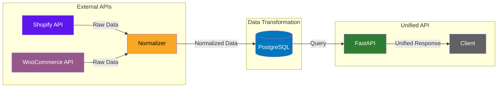

# Commerce Data Normalizer

This project simulates how a unified commerce API might normalize merchant metrics data from different e-commerce platforms like Shopify and WooCommerce, with support for database storage and scheduled updates.

## Features
- Simulates external API calls to Shopify and WooCommerce
- Normalizes merchant metrics into a single schema
- Direct database storage of normalized metrics
- Automatic updates of existing merchant data
- RESTful API for accessing normalized metrics
- Scheduled data fetching from external APIs
- Realistic mock data generation with growth patterns
- Cross-platform merchant metrics aggregation
- Lender-focused borrower metrics views

## Architecture

The system uses a direct API integration approach with scheduled updates. This design choice offers several benefits:

- **Platform Independence**: Each platform (Shopify, WooCommerce) has its own dedicated API client, allowing for:
  - Platform-specific data normalization
  - Independent error handling
  - Simplified monitoring and debugging
  - Easy addition of new platforms

- **Data Flow**:
  ```
  External API Client -> Data Normalization -> Merchant Metrics Table -> REST API
  ```

  Each platform's data flows through its own API client, ensuring that:
  - Platform-specific normalization logic remains isolated
  - Processing issues in one platform don't affect others
  - Data from different platforms can be fetched at different rates

## Use Cases

### Cross-Platform Merchant Metrics
The API provides a unified view of merchant performance across multiple platforms, which is particularly valuable for:

1. **Lenders and Financial Institutions**
   - Get a complete picture of a borrower's e-commerce business
   - View aggregated metrics across all platforms
   - Make informed lending decisions based on total business performance
   - Monitor borrower health across their entire e-commerce presence

2. **Merchant Analytics**
   - Compare performance across different platforms
   - Identify platform-specific strengths and weaknesses
   - Make data-driven decisions about platform investments
   - Track overall business growth regardless of platform

3. **Business Intelligence**
   - Generate reports that combine data from multiple platforms
   - Create unified dashboards for merchant performance
   - Analyze cross-platform trends and patterns
   - Make strategic decisions based on complete data

## Realistic Mock Data

The system generates realistic merchant metrics with the following characteristics:

1. **Initial Ranges** (same for both platforms):
   - Total Sales: $10,000 - $1,000,000
   - Total Orders: 100 - 10,000
   - Average Order Value: $50 - $500
   - Total Customers: 50 - 5,000
   - Total Products: 10 - 1,000

2. **Growth Patterns**:
   - Total Sales: Increases by 0-15% per update
   - Total Orders: Increases by 0-10% per update
   - Average Order Value: Fluctuates by -5% to +5%
   - Total Customers: Increases by 0-5% per update
   - Total Products: Increases by 0-2% per update

3. **Timestamp Management**:
   - `created_at`: Preserved for existing merchants
   - `updated_at`: Updated on every change

## Quick Start

The project includes a Makefile for easy setup and running:

```bash
# Set up everything (venv, dependencies, database)
make setup

# Start all services (API server and scheduler)
make start-all

# Clean up everything
make clean
```

Individual commands:
```bash
# Create virtual environment
make venv

# Install dependencies
make install

# Initialize database
make init-db

# Start API server
make start-api

# Start data scheduler
make start-scheduler

# Make a single API request to a specific platform
make request-shopify  # or request-woocommerce
```

## API

The API provides a RESTful interface for accessing normalized merchant metrics. It's built with FastAPI and includes features like filtering, pagination, and platform-specific queries.

### API Endpoints

1. **Get Merchant Metrics**
   ```
   GET /merchants/{merchant_id}/metrics
   ```
   - Returns metrics for a merchant across all platforms
   - Optional `platform` query parameter to filter by specific platform
   - Includes both individual platform metrics and aggregated totals
   - Example: `GET /merchants/merchant123/metrics?platform=shopify`

   Response:
   ```json
   {
     "merchant_id": "merchant123",
     "merchant_name": "Example Store",
     "platforms": [
       {
         "platform": "shopify",
         "total_sales": 50000.0,
         "total_orders": 1000,
         "average_order_value": 50.0,
         "total_customers": 500,
         "total_products": 100,
         "updated_at": "2024-01-31T00:00:00"
       }
     ],
     "total_sales": 50000.0,
     "total_orders": 1000,
     "average_order_value": 50.0,
     "total_customers": 500
   }
   ```

2. **Get Platform Statistics**
   ```
   GET /platforms/{platform}/stats
   ```
   - Returns aggregated statistics for a specific platform
   - Shows totals across all merchants on that platform
   - Example: `GET /platforms/woocommerce/stats`

   Response:
   ```json
   {
     "platform": "woocommerce",
     "total_merchants": 100,
     "total_sales": 1000000.0,
     "total_orders": 20000,
     "average_order_value": 50.0,
     "total_customers": 50000,
     "total_products": 5000
   }
   ```

3. **Health Check**
   ```
   GET /health
   ```
   - Returns API status and current timestamp

### API Architecture

When you run `uvicorn api.main:app`, the following components work together:

1. **FastAPI Application** (`main.py`):
   - Handles HTTP requests and routing
   - Provides endpoints for merchant metrics queries
   - Includes automatic API documentation at `/docs`

2. **Database Layer** (`database.py`):
   - Manages PostgreSQL connections
   - Provides session management
   - Handles connection pooling

3. **Data Models** (`schemas.py`):
   - SQLAlchemy models for database operations
   - Pydantic models for request/response validation
   - Clear separation between platform and merchant metrics

4. **Utilities**:
   - `pagination.py`: Handles result pagination
   - `filters.py`: Applies query filters (platform, metrics ranges)

### External API Integration

The system simulates external API calls through dedicated clients:

1. **Shopify API Client** (`external/shopify.py`):
   - Generates realistic merchant metrics
   - Simulates API response times
   - Normalizes data into common format

2. **WooCommerce API Client** (`external/woocommerce.py`):
   - Generates realistic merchant metrics
   - Simulates API response times
   - Normalizes data into common format

3. **Data Scheduler** (`external/scheduler.py`):
   - Runs hourly data fetches
   - Updates existing merchant metrics
   - Inserts new merchant data
   - Handles errors and retries

### Making API Requests

You can make direct requests to the external APIs:

```bash
# Fetch data from Shopify
make request-shopify

# Fetch data from WooCommerce
make request-woocommerce
```

Each request will:
1. Connect to the simulated API
2. Generate realistic merchant metrics
3. Update the database with new or updated metrics
4. Show detailed operation results

### Scheduled Updates

The scheduler runs hourly updates to keep data fresh:

```bash
# Start the scheduler
make start-scheduler
```

The scheduler will:
1. Run every hour
2. Fetch data from both platforms
3. Update existing merchant metrics
4. Insert new merchant data
5. Show detailed operation logs

## Database Setup

1. Initialize the database:
```bash
make init-db
```

This will:
- Create a postgres user if it doesn't exist
- Create the commerce_data database
- Set up the merchant_metrics table with the required schema

## Database Schema

The `merchant_metrics` table stores normalized merchant data with the following columns:
- `id`: Auto-incrementing primary key (Integer)
- `merchant_id`: Unique identifier for the merchant (String, max 10 chars)
- `platform`: The e-commerce platform (e.g., 'shopify', 'woocommerce')
- `merchant_name`: Name of the merchant
- `total_sales`: Total sales amount (Float)
- `total_orders`: Total number of orders (Integer)
- `average_order_value`: Average value of orders (Float)
- `total_customers`: Total number of customers (Integer)
- `total_products`: Total number of products (Integer)
- `created_at`: Timestamp when the record was created
- `updated_at`: Timestamp when the record was last updated

There is a unique constraint on (platform, merchant_id) to prevent duplicates.

## Project Structure
- `external/` → External API integration
  - `shopify.py` → Shopify API client
  - `woocommerce.py` → WooCommerce API client
  - `scheduler.py` → Data fetching scheduler
  - `request.py` → Direct API request utility
  - `base.py` → Base API client class
- `database/` → Database setup
  - `init.sh` → Database initialization script
  - `schema.sql` → Database schema definition
- `api/` → REST API components
  - `main.py` → FastAPI application and routes
  - `models.py` → Pydantic models
  - `schemas.py` → SQLAlchemy models
  - `database.py` → Database connection
  - `utils/` → Helper functions
    - `pagination.py` → Pagination logic
    - `filters.py` → Filtering logic

## Dependencies
- psycopg2-binary==2.9.9 (PostgreSQL client)
- python-dotenv==1.0.1 (Environment variable management)
- fastapi==0.109.2 (Web framework)
- uvicorn==0.27.1 (ASGI server)
- sqlalchemy==2.0.27 (ORM)
- pydantic==2.6.1 (Data validation)
- PostgreSQL server

## Data Flow & Transformation Example

The following example demonstrates how we normalize data from different platforms into a unified schema:

### 1. Platform-Specific Data

**Shopify Raw Data**:
```json
{
  "shop_id": "SHOP123",
  "shop_name": "Fashion Forward",
  "gross_sales": 125000.00,
  "orders_count": 2500,
  "average_order_amount": 50.00,
  "customer_count": 1200,
  "product_count": 150,
  "abandoned_cart_rate": 0.25,
  "shopify_plus": true,
  "app_usage": 12
}
```

**WooCommerce Raw Data**:
```json
{
  "store_id": "WC456",
  "store_name": "Tech Gadgets",
  "net_sales": 98000.00,
  "order_volume": 1960,
  "avg_order_total": 50.00,
  "registered_users": 980,
  "published_products": 75,
  "woocommerce_version": "7.2.1",
  "active_plugins": 15,
  "payment_gateways": 3
}
```

### 2. Normalized Database Schema

After transformation, both merchants are stored in our unified schema:

```sql
-- Shopify merchant
INSERT INTO merchant_metrics (
  merchant_id, platform, merchant_name,
  total_sales, total_orders, average_order_value,
  total_customers, total_products
) VALUES (
  'SHOP123', 'shopify', 'Fashion Forward',
  125000.00, 2500, 50.00,
  1200, 150
);

-- WooCommerce merchant
INSERT INTO merchant_metrics (
  merchant_id, platform, merchant_name,
  total_sales, total_orders, average_order_value,
  total_customers, total_products
) VALUES (
  'WC456', 'woocommerce', 'Tech Gadgets',
  98000.00, 1960, 50.00,
  980, 75
);
```

### 3. Cross-Platform Merchant Example

Here's an example of a merchant operating on both platforms:

**Shopify Data**:
```json
{
  "shop_id": "MULTI789",
  "shop_name": "Global Electronics",
  "gross_sales": 200000.00,
  "orders_count": 4000,
  "average_order_amount": 50.00,
  "customer_count": 2000,
  "product_count": 200,
  "abandoned_cart_rate": 0.20,
  "shopify_plus": true,
  "app_usage": 18
}
```

**WooCommerce Data**:
```json
{
  "store_id": "MULTI789",
  "store_name": "Global Electronics",
  "net_sales": 150000.00,
  "order_volume": 3000,
  "avg_order_total": 50.00,
  "registered_users": 1500,
  "published_products": 100,
  "woocommerce_version": "7.2.1",
  "active_plugins": 20,
  "payment_gateways": 4
}
```

### 4. Unified API Response

When querying the merchant across platforms:

```json
{
  "merchant_id": "MULTI789",
  "merchant_name": "Global Electronics",
  "platforms": [
    {
      "platform": "shopify",
      "total_sales": 200000.00,
      "total_orders": 4000,
      "average_order_value": 50.00,
      "total_customers": 2000,
      "total_products": 200,
      "updated_at": "2024-01-31T00:00:00"
    },
    {
      "platform": "woocommerce",
      "total_sales": 150000.00,
      "total_orders": 3000,
      "average_order_value": 50.00,
      "total_customers": 1500,
      "total_products": 100,
      "updated_at": "2024-01-31T00:00:00"
    }
  ],
  "total_sales": 350000.00,
  "total_orders": 7000,
  "average_order_value": 50.00,
  "total_customers": 3500
}
```

### Data Flow Diagram



This diagram shows:
1. Raw data from different platforms with unique schemas
2. Normalization process that transforms data into a unified format
3. Storage in PostgreSQL with consistent schema
4. Unified API that serves normalized data to clients

The example demonstrates how we:
- Handle platform-specific data structures
- Normalize them into a consistent format
- Store them in a unified database
- Serve them through a single API endpoint
- Support cross-platform merchant analysis